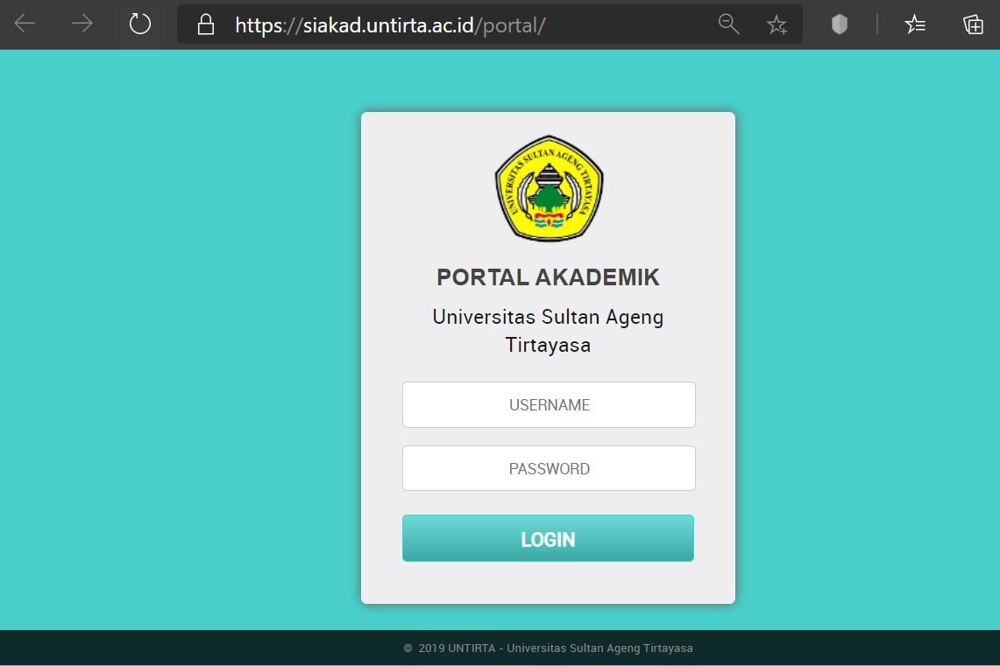
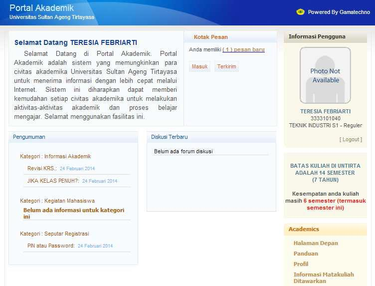
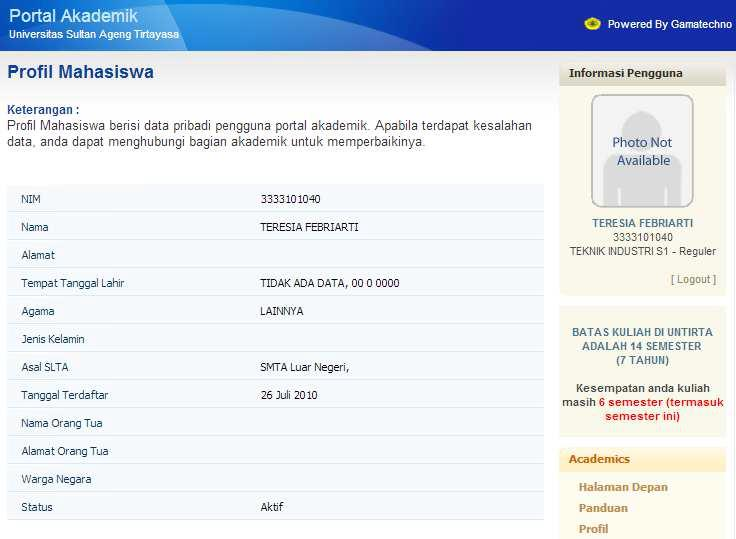
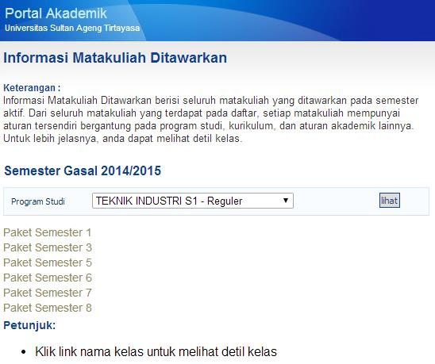
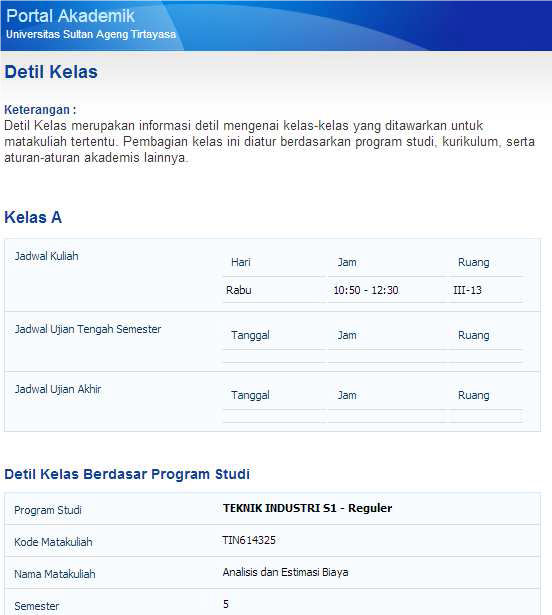
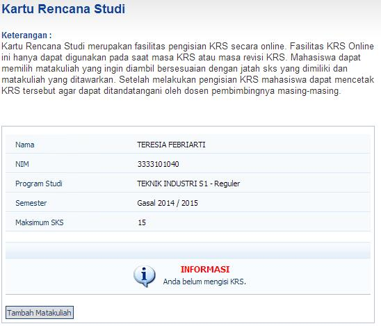
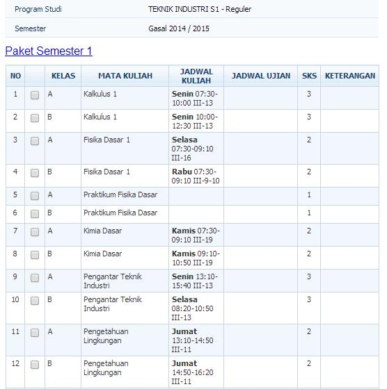
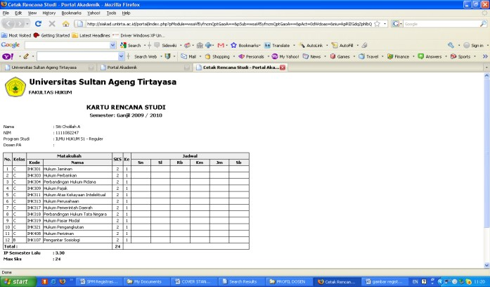
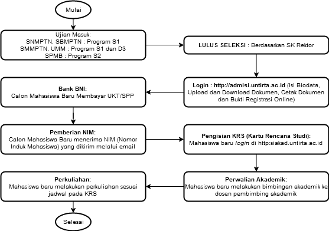

# REGISTRASI MAHASISWA BARU

Registrasi merupakan prosedur awal bagi mahasiswa baru Universitas Sultan Ageng Tirtayasa. Mahasiswa Universitas Sultan Ageng Tirtayasa adalah mahasiswa yang telah menyelesaikan ketentuan dan prosedur yang berlaku. Pada prosesnya prosedur ini melibatkan 6 (enam) entitas, yaitu:

1.  Mahasiswa.
2.  Subbagian Registrasi dan Statistik - BAKP.
3.  Subbagian Kemahasiswaan - BAKP.
4.  Subbagian PNBP - BUKK.
5.  Pusat Data dan Informasi (PUSDAINFO).
6.  Jurusan/Program Studi/Fakultas/Pascasarjana.

## Ketentuan Mahasiswa Baru

Bagi calon mahasiswa baru sudah ***lulus tes seleksi*** / ujian masuk perguruan tinggi di Universitas Sultan Ageng Tirtayasa melalui beberapa jalur masuk : Seleksi Nasional Masuk Perguruan Tinggi Negeri (SNMPTN) dengan Program Sarjana (S1), Seleksi Bersama Masuk Perguruan Tinggi Negeri (SBMPTN) dengan Program Sarjana (S1), Seleksi Masuk Mandiri Perguruan Tinggi Negeri (SMMPTN) dengan Program Sarjana (S1), Ujian Masuk Mandiri (UMM) dengan Program Diploma (D3) dan Seleksi Penerimaan Mahasiswa Baru (SPMB) dengan Program Magister (S2/S3) diselenggarakan oleh Pascasarjana Universitas Sultan Ageng Tirtayasa.

Setelah lulus seleksi bukti lulusnya dituangkan dalam dokumen Surat Keputusan Rektor Universitas Sultan Ageng Tirtayasa tentang hasil seleksi penerimaan mahasiswa baru dari beberapa jalur masuk yang diterbitkan pada tahun akademik oleh Universitas Sultan Ageng Tirtayasa.

Selanjutnya calon mahasiswa melengkapi persyaratan administrasi akademik dan administrasi keuangan / sudah membayar Uang Kuliah Tunggal (UKT)/ Sumbangan Pengembangan Pendidikan (SPP) bagi mahasiswa baru Program Sarjana (S1) dan Program Diploma (D3) dan calon mahasiswa melengkapi persyaratan administrasi akademik dan administrasi keuangan serta sudah membayar Sumbangan Pengembangan Pendidikan (SPP) bagi mahasiswa baru Program Magister (S2/S3).

Bagi mahasiswa baru baik Program Sarjana (S1) dan Program Diploma (D3) melakukan registrasi akademik dengan melengkapi persyaratan dan ketentuan yang telah ditetapkan.

## Waktu Registrasi (1)

Pelaksanaan registrasi mahasiswa baru mengacu pada ketentuan yang telah di tuangkan dalam kalender akademik pada semester gasal (Program Sarjana (S1) dan Diploma (D3), semester gasal dan genap (Program Magister (S2)) sehingga mahasiswa sudah punya dasar dan gambaran yang pasti akan waktu pelaksanaan kegiatan Registrasi Mahasiswa Baru tersebut dan proses perkuliahan dapat berjalan dengan baik.

## Prosedur Persyaratan Mahasiswa Baru

A.  **Mahasiswa Baru**

    Calon mahasiswa melihat informasi ke <http://admisi.untirta.ac.id>,

    1.  Surat Keputusan Rektor Tentang Hasil Seleksi Mahasiswa Baru sesuai dengan jalur masuk SNMPTN, SBMPTN, SMMPTN, UMM.
    2.  Pengumuman Registrasi mahasiswa baru sesuai dengan jalur masuk SNMPTN, SBMPTN, SMMPTN, UMM.
    3.  Alur Registrasi Mahasiswa Baru sesuai dengan jalur masuk SNMPTN, SBMPTN, SMMPTN, UMM.

B.  **Pengisian/Pengambilan Persyaratan Berkas Registrasi**

    Calon Mahasiswa Baru *login* ke <http://admisi.untirta.ac.id>, dengan *username*: Nomor Peserta SNMPTN, SBMPTN, SMMPTN, UMM serta *password*: Tanggal Lahir.

    1.  Pengisian Biodata Mahasiswa dan mengunggah Foto terbaru (latar belakang merah dan memakai kemeja putih).
    2.  Mengunduh Pakta Integritas Uang Kuliah Tunggal (UKT)/Biaya Pendidikan
    3.  Mengunduh dan Surat Pernyataan Mentaati Peraturan Untirta

C.  **Data Pendukung Lampiran Berkas Registrasi**

    Calon Mahasiswa Baru setelah melengkapi persyaratan, *login* kembali ke <http://admisi.untirta.ac.id> dan kemudian **WAJIB** mengunggah seluruh persyaratan tanpa terkecuali antara lain:

    1.  Hasil pindah (*scan*) Kartu Peserta SNMPTN, SBMPTN, SMMPTN, UMM.

    2.  Hasil pindai Ijazah atau SKHUN atau Surat Keterangan Lulus (SKL) bagi yang belum keluar ijasahnya.

    3.  Hasil pindai Tes Kesehatan

    4.  Hasil pindai Tes Narkoba

    5.  Hasil pindai Tes Buta Warna bagi jurusan tertentu:

        a.  **FKIP** : Penddikan Biologi, Pendidikan Kimia, Pendidikan Fisika, Pendidikan IPA, Pendidikan Teknik Elektro, Pendidikan Teknik Mesin. PAUD.
        b.  **Fakultas Teknik** : Teknik Kimia, Teknik Metalurgi, Teknik Mesin, Teknik Elektro.
        c.  **Fakultas Pertanian** : Agribisnis, Agroekoteknologi, Perikanan, Teknologi Pangan.
        d.  **Fakultas Kedokteran** : Keperawatan (D3).

    6.  Hasil pindai Akte Kelahiran.

    7.  Hasil pindai Tagihan Rekening Listrik Bulan terbaru dan tahun berjalan

    8.  Hasil pindai Pajak Bumi dan Bagunan (PBB) terbaru.

    9.  Hasil pindai Kartu Keluarga (KK).

    10. Hasil pindai Slip Pengasilan orang tua bagi calon mahasiswa yang orang tuanya bekerja sebagai PNS/Swasta, yang ditanda-tangani oleh pejabat/pimpinan instansi tempat kerja, atau Hasil pindai Surat Keterangan Penghasilan yang ditandatangani oleh kelurahan atau kecamatan, jika orang tua bekerja sebagai Wiraswasta / Pedagang / Buruh / Petani / Pensiunan. (Jika kedua orang tua bekerja).

D.  **Verifikasi data registrasi oleh Subbagian Registrasi dan Statistik terhadap data yang telah diunggah oleh calon mahasiswa baru**

    Tim dari Subbagian Registrasi dan statitik akan memeriksa data yang telah diunggah. Apabila data yang diunggah tidak lengkap maka tim akan menghubungi calon mahasiwa baru tersebut. Data ini diperlukan untuk menentukan dasar penentuan besaran UKT calon mahasiswa baru

E.  **Pengisian/Pengambilan Persyaratan Berkas Registrasi Program Magister (S2)**

    Calon Mahasiswa Baru pengambilan persyaratan di Subbagian Akademik Pascasarjana, Universitas Sultan Ageng Tirtayasa. Persyaratan yang harus dilengkapi calon mahasiswa baru:

    1.  Kartu Tanda Peserta Ujian SPMB
    2.  Pengisian Biodata Mahasiswa.
    3.  Ijazah S1, Akta IV (bagi yang memiliki AKTA IV) dan Transkrip Akademik di legalisir/Surat Keterangan Lulus asli bagi yang belum keluar Ijazah, Akta IV dan Transkrip Akademik.
    4.  Slip Pembayaran SPP.
    5.  Pas Photo terbaru berwarna (ukuran: 3x4): 2 Lembar.

## Biro Akademik, Kemahasiswaan, dan Perencanaan (BAKP)

A.  **Subbagian Registrasi dan Statistik memverifikasi Berkas Registrasi Mahasiswa Baru**

    1.  **Program Sarjana (S1) dan Diploma (D3)**

        Bagi calon mahasiswa setelah melakukan pengisian / pengambilan persyaratan registrasi secara *online* (mengunduh dan mengunggah), persyaratan poin 3 nomor 3.1. -- 3.6 dan 3.12 -- 3.13 dibawa untuk dicek kebenarannya (membawa persyaratan asli) Ke Subbagian Registrasi dan Statistik, Biro Akademik, Kemahasiswaan dan Perencanaan (BAKP).

    2.  **Program Magister (S2)**

        Bagi calon mahasiswa setelah melakukan pengisian/pengambilan persyaratan dan sudah melengkapi persyaratan registrasi diserahkan ke Subbagian Akademik Pascasarjana, berkas persayaratan tersebut secara kolektif oleh Subbagian Akademik Pascasarjana di serahkan ke Subbagian Registrasi dan Statistik (BAKP) untuk diverifikasi.

B.  **Subbagian Kemahasiswaan memverifikasi Berkas Bidikmisi Mahasiswa Baru Program Sarjana (S1)**

    Bagi Calon Mahasiswa Bidikmisi diharap melakukan registrasi Bidikmisi dengan melengkapi persyaratan sebagai mahasiswa baru Bidikmisi dengan menyerahkan persyaratan Bidikmisi untuk di verifikasi berkas Bidikmisi ke Subbagian Kemahasiswaan, Biro Akademik, Kemahasiswaan, dan Perencanaan (BAKP), di antaranya:

    1.  Kopi Kartu Tanda Penduduk (KTP).

    2.  Kopi Kartu Keluarga (KK).

    3.  Kopi Kartu Indonesia Pintar.

    4.  Surat Keterangan Tidak Mampu (SKTM) dari kelurahan setempat.

    5.  Kopi Rekening Listrik (Bulan Terakhir).

    6.  Slip Penghasilan Orang Tua/Slip Gaji

    7.  Pas Photo Ukuran 3x4 Berwarna = 2 Lembar.

    8.  Photo Rumah Tinggal Ukuran Poscard Berwarna, dengan ketentuan sebagai berikut:

        a.  Photo Rumah Tapak Depan.
        b.  Photo Rumah Tampak Belakang.
        c.  Photo Ruang Dapur

    9.  Mengisi Form Surat Pernyataan Bermaterai Beasiswa Bidikmisi (Form bisa dapat di Subbagian Kemahasiswaan)

    10. Esai yang ditulis tangan tentang kondisi perekonomian, rutinitas belajar dan kondisi keluarga, dalam kertas folio bergaris maksimal 2 lembar dan ditandatangani.

Semua berkas tersebut dimasukan ke dalam map berwarna dengan ketentuan sebagai berikut:

-   Fakultas Hukum: **MERAH**.
-   Fakultas Keguruan dan Ilmu Pendidikan: **HIJAU**.
-   Fakultas Teknik: **BIRU**.
-   Fakultas Ekonomi: **KUNING**.
-   Fakultas Pertanian: **COKLAT**.
-   Fakultas Ilmu Sosial dan Ilmu Politik: **ORANGE**.
-   Fakultas Kedokteran:

------------------------------------------------------------------------

> Catatan:
>
> 1.  Proses Verifikasi tidak dapat diwakilkan dan harus hadir sesuai dengan jadwal registrasi yang telah ditetapkan.
> 2.  Bagi calon mahasiswa yang tidak melakukan registrasi dan pembayaran UKT pada tanggal yang telah ditetapkan dianggap **MENGUNDURKAN DIRI**.
> 3.  Bagi Calon Mahasiswa Bidikmisi diharap melakukan registrasi Akademik dengan melengkapi persyaratan sebagai mahasiswa secara online dan menyerahkan persyaratan aslinya ke Subbagian Registrasi dan Statistik, Biro Akademik, Kemahasiswaan dan Perencanaan (BAKP), untuk diverifikasi.
> 4.  Bagi calon mahasiswa yang tidak melakukan registrasi pemberkasan Mahasiswa Baru Bidikmisi pada tanggal yang telah ditetapkan dianggap **MENGUNDURKAN** **DIRI**.

------------------------------------------------------------------------

## Biro Umum, Keuangan, dan Kepegawaian

**Subbagian Penerimaan Bukan Pajak (PNBP) memverifikasi Berkas Registrasi Mahasiswa Baru**

Bagi calon mahasiswa setelah melakukan pengisian/pengambilan persyaratan registrasi secara *online* (mengunduh dan mengunggah), persyaratan poin 1 nomor 7-11 akan diverifikasi oleh Subbagian Penerimaan Bukan Pajak (PNBP) Biro Umum Keuangan dan Kepegawaian (BUKK) dan sebagai dasar untuk menentukan besaran UKT yang akan diterima oleh Mahasiswa Baru.

------------------------------------------------------------------------

> **Catatan** :
>
> 1.  Proses Registrasi bagi Mahasiswa Warga Negara Asing (WNA) didampingi oleh UPT Pusat Layanan Internasional (PLI) Untirta.
> 2.  Ketentuan umum yang berlaku bagi Mahasiswa Warga Negara Asing (WNA) mengikuti ketentuan yang berlaku di Kementerian Riset Teknologi dan Pendidikan Tinggi Republik Indonesia.

------------------------------------------------------------------------

## Bank (BNI 46)

A.  **Program Sarjana (S1) dan Diploma (D3).**

    Pembayaran Uang Kuliah Tunggal (UKT) berdasarkan PERMENDIKBUD No.50 Tentang Uang Kuliah Tunggal (UKT) yang disesuaikan berdasarkan data penghasil orang tua/kedua orang tua jika kedua orang tua memiliki/mendapatkan penghasilan yang diberikan sebagai persyaratan mahasiswa baru, dituangkan dalam dokumen Surat Keputusan Rektor Universitas Sultan Ageng Tirtayasa tentang Penetapan Biaya Pendidikan Uang Kuliah Tunggal (UKT) Bagi Mahasiswa Baru Program Sarjana (S1) dan Diploma (D3) dari beberapa jalur masuk pada tahun akademik oleh Universitas Sultan Ageng Tirtayasa. Pembayaran dilakukan di seluruh cabang Bank BNI, dengan menyebutkan nomor ujian, sesuai dengan jadwal yang telah ditentukan.

B.  **Program Magister (S2)**

    Pembayaran Sumbangan Pengembangan Pendidikan (SPP) berdasarkan penetapan Surat Keputusan Rektor Tentang Penetapan Besaran Pembayaran Sumbangan Pengembangan Pendidikan (SPP), Bagi Mahasiswa Baru Program Magister (S2) berdasarkan penerimaan mahasiswa baru pada tahun masuk/gelombang. Pembayaran dilakukan di seluruh cabang Bank BNI, dengan menyebutkan nomor ujian sesuai dengan jadwal yang telah ditentukan.

C.  **Kartu Tanda Mahasiswa (KTM plus ATM)**

    Kartu Tanda Mahasiswa (KTM) yang juga berfungsi sebagai ATM, diberikan kepada mahasiswa baru setelah menyelesaikan persyaratan akademik, keuangan, sudah mendapatkan Nomor Induk Mahasiswa (NIM) dan sudah mendapatkan dari Kartu Tanda Mahasiswa (KTM) Sementara, serta sudah membuka rekening Bank BNI Cabang Serang, sebagai persyaratan pembuatan KTM/ATM yang berfungsi sebagai identitas mahasiswa Universitas Sultan Ageng Tirtayasa yang dikeluarkan oleh Bank BNI Cabang Serang.

## Subbagian Registrasi dan Statistik - BAKP

A.  **Pemberian Nomor Induk Mahasiswa (NIM)**

    Nomor Induk Mahasiswa (NIM) sebagai identitas mahasiswa diberikan kepada mahasiswa baru yang telah melengkapi semua persyaratan. selain NIM, mahasiswa baru juga diberikan PIN sebagai *password* untuk mengakses SIAKAD (pengisian / pengambilan mata kuliah / Kartu Rencana Studi (KRS), dan lain-lain).

    **Keterangan:**

    Nomor Induk Mahasiswa (NIM) yang terdiri atas kode Fakultas, Kode Jurusan/Program Studi, Kode Angkatan, dan Nomor Urut Mahasiswa.

    **Identifikasi Kode:**

    -   Fakultas: 2 (dua) digit.
    -   Jurusan/Program Studi: 2 (dua) digit.
    -   Tahun Masuk/Angkatan: 2 (dua) digit.
    -   Nomor Urut: 4 (empat) digit.

    **Contoh**:

    -   Fakultas: Hukum (**11**)

        Program Studi: Ilmu Hukum (**11**)

        Tahun Masuk: 2020 (**20**)

        Nomor Urut: **1**

        NIM: **111120**000**1**

    -   Fakultas: Pascasarjana (**77**)

        Program Studi: Pendidikan Bahasa Indonesia (**71**)

        Tahun Masuk: 2020 (**20**)

        Nomor Urut: **1**

        NIM: **777120**000**1**

B.  **Kartu Tanda Mahasiswa (KTM) Sementara.**

    Kartu Tanda Mahasiswa (KTM) Sementara diberikan kepada mahasiswa baru setelah menyelesaikan persyaratan akademik, keuangan, dan sudah mendapatkan Nomor Induk Mahasiswa (NIM), yang sifatnya KTM sementara sebagai identitas mahasiswa.

## Pusat Data dan Informasi (PUSDAINFO)

Pusat data dan Informasi (PUSDAINFO) menyiapkan Aplikasi Sistem Registrasi *Online* /SIREG *Online* dan Aplikasi Sistem Akademik *Online*/SIAKAD *Online*.

## Prosedur Kontrak Mata Kuliah (1)

A.  **Mahasiswa**

    Setelah mahasiswa baru menyelesaikan persyaratan administrasi akademik, keuangan, dan sudah memiliki NIM (Nomor Induk Mahasiswa) dan PIN yang diberikan oleh Subbagian Registrasi dan Statistik - BAKP, mahasiswa baru melakukan registrasi *online*: SIREG *online* dan SIAKAD *online*, prosedurnya sebgai berikut:

    1.  Membuka website <http://siakad.untirta.ac.id/portal> kemudian *login* (segera ganti PIN/*password*)

        {width="600"}

        Jika *login* berhasil maka akan masuk ke halaman depan seperti berikut.

        *{width="600"}*

        ***Profil Mahasiswa***

        {width="600"}

        ***Informasi mata kuliah yang ditawarkan***

        {width="600"}

        Klik **Paket Semester** yang ada lalu klik kelas, nanti akan muncul detil kelas terkait kelas yang dibuka tersebut. {width="600"}

        ***Kartu Rencana Studi*** **(KRS)**

        Mengontrak Rencana Studi lalu mencetak Kartu Rencana Studi (KRS) adalah salah satu syarat bahwa mahasiswa tersebut aktif pada semester berjalan. Jika tidak melakukan pengisian KRS, maka mahasiswa dianggap tidak aktif. Pengisian KRS baru bisa dilakukan pada periode yang ditentukan oleh PUSDAINFO dan ketika jadwal kuliah sudah diuunggah oleh Program Studi. **Klik Kartu Rencana Studi (KRS)**. Kemudian **Klik Tambah Matakuliah**.

        {width="600"}

        Setelah muncul paket semesternya lalu

        a.  Klik paket semesternya

        b.  Bagi mahasiswa baru (semester 1), mata kuliah sudah paket dan kelasnya sudah ditentukan oleh Program Studi. Oleh karena itu, mahasiswa baru sebaiknya meminta bantuan Program Studi untuk mengetahui mata kuliah berikut kelasnya.

        c.  Setelah selesai memilih kelas, lalu klik Tambah

        d.  Cetak KRS dan temui dosen Pembimbing Akademik untuk meminta persetujuan KRS.

            {width="556"}

    2.  Kontrak mata kuliah / Pengambilan mata kuliah yang telah ditetapkan, pada semester yang akan ditempuh, mahasiswa baru mengisi Kartu Rencana Studi (KRS) secara on line , dicetak untuk diserahkan ke fakultas/jurusan/program studi atau sebagai dokumen pribadi.

    3.  Mahasiswa baru melakukan konsultasi bimbingan akademik/ mata kuliah ke dosen wali/dosen pembimbing akademik di fakultas untuk disetujui dan ditandatangani dan distempel oleh fakultas.

    4.  Mahasiswa baru melihat jadwal perkuliahan dan dosen dengan mata kuliah yang akan diajar di Fakultas.

B.  **Pusat Data dan Informasi (PUSDAINFO)**

    1.  Pusat Data dan Informasi (PUSDAINFO**)** menerima data mahasiswa yang telah mengisi Kartu Rencana Studi (KRS) dan mendapat bimbingan akademiknya, mahasiswa segera menyerahkan Kartu Rencana Studi (KRS) nya ke Pusat Data dan Informasi (PUSDAINFO) baik cetak maupun elektronik.
    2.  Mengolah data dan menerbitkan Kartu Rencana Studi (KRS) dan Daftar Hadir Mahasiswa dan Dosen (DHMD).

C.  **Subbagian Akademik Pascasarjana**

    1.  Subbagian Akademik Pascasarjana menerima data mahasiswa yang telah mengisi Kartu Rencana Studi (KRS) dan mendapat bimbingan akademiknya, mahasiswa segera menyerahkan Kartu Rencana Studi (KRS) nya ke Subbagian Akademik Pascasarjana.
    2.  Mengolah data dan menerbitkan Kartu Rencana Studi (KRS) dan Daftar Hadir Mahasiswa dan Dosen (DHMD).

D.  **Perkuliahan Mahasiswa Baru** Setelah mahasiswa mendapatkan Kartu Rencana Studi (KRS) dan namanya tercantum dalan Daftar Hadir Mahasiswa dan Dosen (DHMD), mahasiswa dapat mengikuti perkuliahan sesuai mata kuliah yang dikontrak/diambil dalam Kartu Rencana Studi (KRS).

## Petugas Registrasi (1)

Petugas Registrasi yang terkait dalam pelaksanaan registrasi mahasiswa baru tersebut melibatkan petugas:

A.  **Biro Akademik, Kemahasiswaan, dan Perencanaan (BAKP)**

    Biro Akademik, Kemahasiswaan dan Perencanaan (BAKP) Universitas Sultan Ageng Tirtayasa melalui :

    1.  Subbagian Registrasi dan Statistik melaksanakan tugasnya melayani registrasi mahasiswa baru yang melakukan registrasi Akademik, mendokumentasikan laporan dan melakukan koordinasi dengan Subbagian Penerimaan Negara Bukan Pajak (PNBP) , Pusat Data dan Informasi (PUSDAINFO) , Subbagian Kemahasiswaan, Subbagian Akademik Pascasarjana dan petugas bank yang ditunjuk yaitu Bank BNI.
    2.  Subbagian Kemahasiswaan melaksanakan tugasnya melayani registrasi mahasiswa baru yang melakukan registrasi Bidikmisi, mendokumentasikan laporan dan melakukan koordinasi dengan Subbagian Penerimaan Negara Bukan Pajak (PNBP) , Pusat Data dan Informasi (PUSDAINFO), serta Subbagian Registrasi dan Statistik.

B.  **Biro Umum, Keuangan, dan Kepegawaian (BUKK)**

    Biro Umum, Keuangan, dan Kepegawaian (BUKK) Universitas Sultan Ageng Tirtayasa melaksanakan tugasnya sebagai biro yang menangani bidang keuangan melalui Subbagian Penerimaan Negara Bukan Pajak (PNBP) yang ditugaskan langsung menangani kegiatan registrasi mahasiswa baru yang melakukan pembayaran UKT/SPP, mendokumentasikan laporan, dan mengadakan koordinasi dengan Subbagian Registrasi dan Statistik, Pusat Data dan Informasi (PUSDAINFO), Subbagian Kemahasiswaan, Subbagian Akademik Pascasarjana, dan petugas bank yang ditunjuk yaitu Bank BNI.

C.  **Bank BNI**

    Melaksanakan tugasnya sebagai Bank yang ditunjuk oleh Universitas Sultan Ageng Tirtayasa sebagai Bank yang menerima pembayaran registrasi mahasiswa Baru yaitu: Uang Kuliah Tunggal (UKT) untuk program Sarjana (S1) dan Diploma (D3), serta Sumbangan Pengembangan Pendidikan (SPP) untuk Program Magister (S2) dan Doktor (S3), melaksanakan koordinasi dengan Subbagian Penerimaan Negara Bukan Pajak (PNBP), Pusat Data dan Informasi (PUSDAINFO), dan Subbagian Registrasi dan Statistik.

D.  **Pusat Data dan Informasi (PUSDAINFO)**

    Pusat data dan Informasi (PUSDAINFO) melakukan verifikasi data mahasiswa baru yang melakukan registrasi dan mengolah data serta menyiapkan *output* yang berkaitan dengan proses kegiatan registrasi dan heregistrasi mahasiswa (KRS, KHS, DHMD, dll), mendokumentasikan laporan dan melakukan koordinasi denan Subbagian Penerimaan Negara Bukan Pajak (PNBP), Subbagian Registrasi dan Statistik, Subbagian Kemahasiswaan, Subbagian Akademik Pascasarjana, Fakultas, Jurusan/Program Studi, dan petugas bank yang ditunjuk yaitu Bank BNI.

E.  **Jurusan/Program Studi**

    Jurusan/Program Studi menerima data mahasiswa baru yang telah di verifikasi/melakukan registrasi dari Pusat Data dan Informasi (PUSDAINFO) dan melaksanakan tugasnya melayani mahasiswa sebelum kegiatan perkuliahan Yaitu :untuk menetapkan dosen pembimbing akademik/wali, melakukan konsultasi bimbingan akademik oleh dosen pembimbing akademik/wali, menandatangani persetujuan pengambilan mata kuliah oleh dosen pembimbing akademik/wali, membuat jadwal perkuliahan dan Daftar Hadir Mahasiswa dan Dosen (DHMD).

F.  **Pascasarjana/Fakultas**

    Pascasarjana/Fakultas mengendalikan operasional jalannya kegiatan perkuliahan sesuai dengan jadwal perkuliahan yang telah ditentukan.

