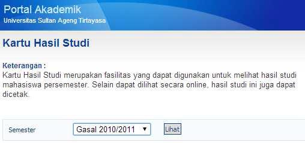
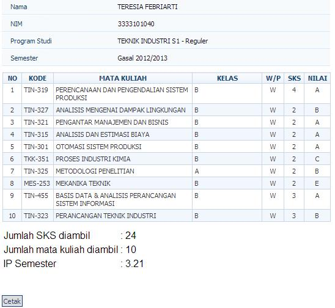
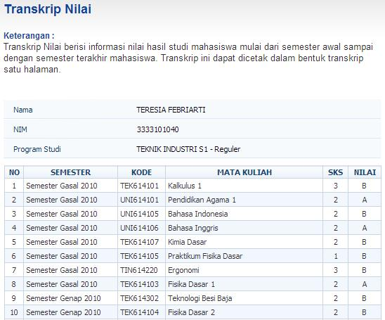
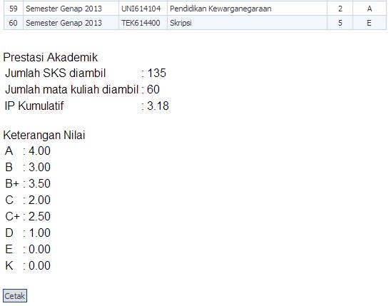
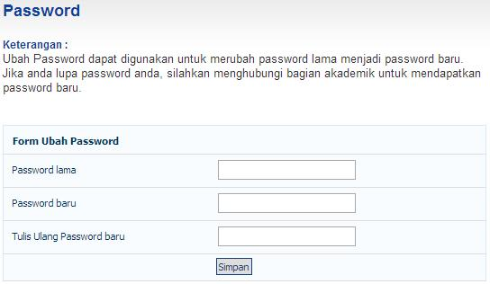
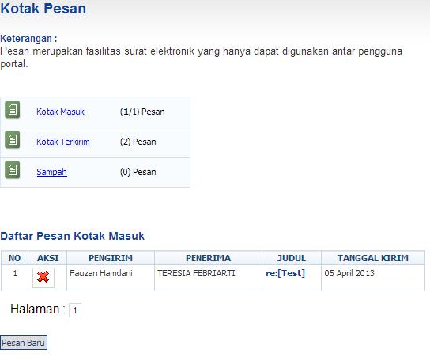
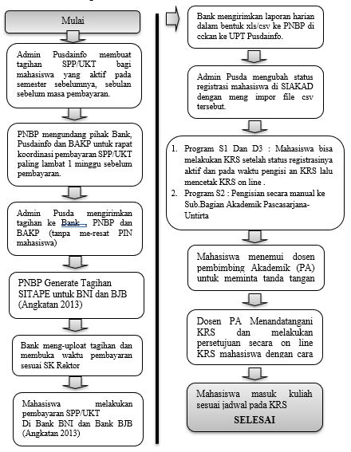

# REGISTRASI MAHASISWA LAMA

Ketentuan registrasi mahasiswa lama setiap mahasiswa Untirta diwajibkan melakukan registrasi sebelum  melakukan perkuliahan dengan melakukan registrasi keuangan dan akademik, prosedur ini dilakukan untuk menghindari mahasiswa dari sanksi akademik dicutikan.

Pada prosesnya prosedur ini melibatkan 6 (enam) entitas:

1.  Mahasiswa
2.  Bank
3.  Jurusan/Program Studi/Fakultas/Pascasarjana
4.  Subbagian Registrasi & Statistik/BAKP
5.  Subbagian PNBP/BUKK.
6.  Pusat Data dan Informasi (PUSDAINFO).

## Ketentuan Mahasiswa Lama

A.  **Program Sarjana (S1) dan Program Diploma (D3)**

    1.  Mahasiswa melakukan registrasi keuangan/membayar SPP/UKT yaitu membayar ke Bank BNI  sampai mendapatkan bukti pembayarannya (Slip Pembayaran).
    2.  Mahasiswa setelah membayar SPP/UKT ke Bank BNI, sebagai bukti mahasiswa aktif ataupun status lainnya.
    3.  Mahasiswa mengambil Kartu Hasil Studi (KHS) dan melakukan registrasi kontrak mata kuliah/pengambilan mata kuliah / Kartu Rencana Studi (KRS) melakukan registrasi *online* / SIAKAD *online*.

B.  **Program Magister (S2)**

    1.  Mahasiswa melakukan registrasi keuangan/membayar SPP yaitu membayar ke Bank BNI yang ditunjuk sampai mendapatkan bukti pembayarannya (Slip Pembayaran).
    2.  Mahasiswa setelah membayar SPP ke Bank BNI kemudian menyerahkan bukti pembayaran/slip bank ke Pascasarjana sebagai bukti mahasiswa aktif ataupun status lainnya.
    3.  Mahasiswa mengambil Kartu Hasil Studi (KHS) dan melakukan registrasi kontrak mata kuliah/pengambilan mata kuliah / Kartu Rencana Studi (KRS) di Pascasarjana.

------------------------------------------------------------------------

> Keterangan :
>
> Bagi Program Sarjana (S1) dan Program Diploma (D3) :
>
> 1.  Laman <https://siakad.untirta.ac.id/portal/>  atau : <https://siakad.untirta.ac.id/sia> fak.
> 2.  Adanya http (HyperTex Transfer Protocol Secured).
> 3.  Jika pada saat mau ke laman tersebut kemudian ada warning untrusted certificate, klik continue saja.
> 4.  Registrasi Ulang (Herregistrasi) mahasiswa lama tidak lagi dilakukan dengan mengubah (mereset) PIN SIAKAD.
> 5.  Setiap Mahasiswa Untirta yang pernah memiliki PIN dapat menggunakan KHS tanpa harus membayar SPP/UKT terlebih dahulu.
> 6.  Setiap mahasiswa yang tidak memiliki PIN berhak mendapatkan PIN selama yang bersangkutan masih tercatat sebagai mahasiswa Untirta.

------------------------------------------------------------------------

## Waktu Registrasi (2)

Pelaksanaan registrasi mahasiswa lama mengacu pada ketentuan yang telah di tuangkan dalam kalender akademik baik pada semester gasal maupun pada semester genab, sehingga mahasiswa sudah mempunyai dasar dan gambaran yang pasti akan waktu pelaksanaan kegiatan registrasi tersebut dan proses perkuliahan dapat berjalan dengan baik.

## Prosedur Kontrak Mata Kuliah (2)

A.  **Mahasiswa**

    1.  Membuka halaman <https://siakad.untirta.ac.id/portal/> kemudian *login*.

        {width="800"}

        Jika *login* berhasil maka akan masuk ke halaman depan seperti berikut.

        {width="800"}

        ***Profil mahasiswa***

        {width="800"}

        ***Informasi mata muliah yang ditawarkan***

        

        Klik **Paket Semester** yang ada lalu klik kelas, nanti akan muncul detil kelas terkait kelas yang dibuka tersebut.

        

        ***Kartu Rencana Studi*** **(*KRS*)**

        Lakukan kontrak mata kuliah sesuai petunjuk dan sesuai dengan Kartu Rencana Studi (KRS) yang sudah disetujui oleh Dosen pembimbing/Dosen Wali. Mengontrak Rencana Studi lalu mencetak Kartu Rencana Studi (KRS) adalah salah satu syarat bahwa mahasiswa tersebut aktif pada semester berjalan. Jika tidak melakukan KRS maka mahasiswa **Dianggap Tidak Aktif (Dicutikan).** KRS baru bisa dilakukan pada periode yang ditentukan oleh UPT. PUSDAINFO, dan jadwal kuliah sudah di-*upload* oleh Program Studi. **Klik Kartu Rencana Studi**. **Klik Tambah Mata Kuliah**.

        

        Setelah muncul paket semesternya lalu:

        -   Klik paket semesternya

        -   Lalu pilih mata kuliah yang anda inginkan. (Catatan : bagi mahasiswa baru (tingkat 1), mata kuliah sudah paket dan kelasnya sudah ditentukan oleh Program Studi, maka sebaiknya tanyakan anda harus memilih mata kuliah apa dan kelasnya kelas apa.

            

        -   Setelah selesai memilih kelas, lalu klik **Tambah**

        -   Cetak KRS, lalu temui dosen Pembimbing Akademik untuk meminta persetujuan KRS.

        -   Copy kontrak mata kuliahnya atau *print out* dan simpan sebagai dokumen pribadi.

        ***Kartu Hasil Studi*** **(*KHS*)**

        -   Pilih semester di mana anda ingin melihat hasil studi anda. Lalu klik lihat.

        -   Akan muncul seluruh mata kuliah dan nilai mata kuliah yang pernah anda ambil pada semester tersebut. Kemudian jika ingin mencetaknya silahkan klik cetak.

            

            {width="508"}

        ***Transkrip Nilai***

        Setelah diklik **Transkrip nilai**, seluruh nilai mata kuliah akan muncul sesuai kurikulum yang menjadi acuannya. Klik **cetak** jika ingin mencetak transkrip.

        

        

        ***Mengubah Password*** **(*Kode Akses*)**

        Penting bagi mahasiswa untuk menjaga kerahasiaan *password*. Gunakan *password* yang gampang diingat dan tidak mudah ditebak oleh orang lain.

        

        ***Berkirim Pesan***

        Mahasiswa bisa berkirim pesan kepada seluruh mahasiswa dan dosen melalui portal akademik seperti berkirim email dengan alamat atau akun yang dituju adalah NIM mahasiswa dari orang yang akan dikirimkan pesan.

        

    2.  Mahasiwa melihat jadwal perkuliahan di fakultas untuk mengambil mata kuliah, dan dosen yang telah ditentukan oleh fakultas.

    3.  Kontrak mata kuliah/Pengambilan mata kuliah / Pengisian Kartu Rencana Studi (KRS), dicetak untuk diserahkan ke fakultas dan disetujui oleh dosen pembimbing / dosen wali, ditanda tangani, dan distempel fakultas.

    4.  Kartu Rencana Studi (KRS) diserahkan ke Pusat Data dan Informasi (PUSDAINFO).

    5.  Hasil Kartu Rencana Studi (KRS) *online* dicetak untuk diserahkan ke fakultas/jurusan/program studi.

B.  **Fakultas/Jurusan/Program Studi**

    Mahasiswa setelah melakukan registrasi *online* /SIAKAD *online* dan hasilnya kemudian dicetak untuk diserahkan ke fakultas/jurusan/program studi masing-masing untuk melakukan:

    1.  Melakukan kontrak mata kuliah pada semester yang akan diambil.

    2.  Melakukan konsultasi bimbingan akademik dari wali akademik/dosen pembimbing untuk menyetujui mata kuliah yang akan diambil.

    3.  Mengisi Kartu Rencana Studi (KRS) dengan lengkap dan menyerahkan ke PUSDAINFO.

C.  **Pusat Data dan Informasi (PUSDAINFO)**

    Pusat Data dan Informasi (PUSDAINFO) memproses Kartu Rencana Studi (KRS) dan diberikan kepada mahasiswa (dapat dilakukan oleh mahasiswa sendiri secara *online*).

D.  **Mahasiswa**

    1.  Mendapatkan Kartu Rencana Studi (KRS) sesuai dengan mata kuliah yang dikontraknya.

    2.  Setelah mahasiswa mendapatkan Kartu Rencana Studi (KRS) dan namanya tercantum dalan Daftar Hadir Mahasiswa dan Dosen (DHMD), mahasiswa mengikuti perkuliahan sesuai mata kuliah yang dikontrak dalam Kartu Rencana Studi (KRS).

## Petugas Registrasi (2)

Petugas Registrasi yang terkait dalam pelaksanaan registrasi ulang mahasiswa lama antara lain:

A.  **Biro Akademik, Kemahasiswaan, dan Perencanaan (BAKP)**

    Biro Akademik, Kemahasiswaan, dan Perencanaan (BAKP) Universitas Sultan Ageng Tirtayasa melalui Subbagian Registrasi dan Statistik melaksanakan tugasnya melayani mahasiswa lama yang melakukan registrasi, mendokumentasikan laporan dan melakukan koordinasi dengan Subbagian Penerimaan Negara Bukan Pajak (PNBP), Pusat Data dan Informasi (PUSDAINFO), Jurusan/Prodi/Fakultas, Subbagian Akademik Pascasarjana, dan petugas bank yang ditunjuk (Bank BNI).

B.  **Biro Umum, Keuangan, dan Kepegawaian (BUKK)**

    Biro Umum, Keuangan, dan Kepegawaian (BUKK) Universitas Sultan Ageng Tirtayasa melaksanakan tugasnya sebagai biro yang menangani bidang keuangan melalui sub bagian Penerimaan Negara Bukan Pajak (PNBP) yang ditugaskan melayani mahasiswa lama yang melakukan registrasi, mendokumentasikan laporan dan melakukan koordinasi pada Subbagian Registrasi dan Statistik, Pusat Data dan Informasi (PUSDAINFO), Subbagian Kemahasiswaan, Subbagian Akademik Pascasarjana dan petugas bank yang ditunjuk yaitu Bank BNI perihal mahasiswa lama yang melakukan registrasi akademik dan mengadministrasikan/laporan registrasi mahasiswa baru yang melakukan pembayaran Uang Kuliah Tunggal (UKT) program Sarjana (S1) dan Diploma (D3) dan Sumbangan Pengembangan Pendidikan (SPP) Program Magister (S2).

C.  **Bank BNI**

    Melaksanakan tugasnya sebagai Bank yang ditunjuk oleh Universitas Sultan Ageng Tirtayasa sebagai Bank yang menerima pembayaran mahasiswa lama yang melakukan registrasi yaitu : Uang Kuliah Tunggal (UKT) program Sarjana (S1) dan Diploma (D3) dan Sumbangan Pengembangan Pendidikan (SPP) Program Magister (S2) dan Doktor (S3), melaksanakan koordinasi dengan Subbagian Penerimaan Negara Bukan Pajak (PNBP), Pusat Data dan Informasi (PUSDAINFO), dan Subbagian Registrasi dan Statistik.

D.  **Pusat Data dan Informasi (PUSDAINFO)**

    Pusat Data dan Informasi (PUSDAINFO) menerima data mahasiswa lama yang melakukan registrasi dan yang telah mengisi Kartu Rencana Studi (KRS) dan mendapat bimbingan akademiknya, mahasiswa segera menyerahkan Kartu Rencana Studi (KRS) nya ke Pusat Data dan Informasi (PUSDAINFO) baik cetak maupun elektronik.

    1.  Mengolah data dan menerbitkan Kartu Rencana Studi (KRS) dan Daftar Hadir Mahasiswa dan Dosen (DHMD).
    2.  Mendokumentasikan laporan.
    3.  Melaksanakan koordinasi dengan Subbagian Penerimaan Negara Bukan Pajak (PNBP), Subbagian Registrasi dan Statistik, Jurusan/Program Studi, Fakultas, Subbagian Akademik Pascasarjana, dan petugas bank yang ditunjuk yaitu Bank BNI.

E.  **Jurusan/Program Studi**

    Jurusan/Program Studi menerima data mahasiswa lama yang telah melakukan registrasi dan melakukan Kartu Rencana Studi (KRS) membuat jadwal perkuliahan dan Daftar Hadir Mahasiswa dan Dosen (DHMD).

F.  **Pascasarjana**

    1.  Subbagian Akademik Pascasarjana menerima data mahasiswa yang telah mengisi pada Kartu Rencana Studi (KRS) dan mendapat bimbingan akademiknya, mahasiswa segera menyerahkan Kartu Rencana Studi (KRS) nya ke Subbagian Akademik Pascasarjana.

    2.  Mengolah data dan menerbitkan Kartu Rencana Studi (KRS) dan Daftar Hadir Mahasiswa dan Dosen (DHMD).

G.  **Pascasarjana/Fakultas**

    Mengendalikan operasional jalannya kegiatan perkuliahan sesuai dengan jadwal perkuliahan yang telah ditentukan.

    
