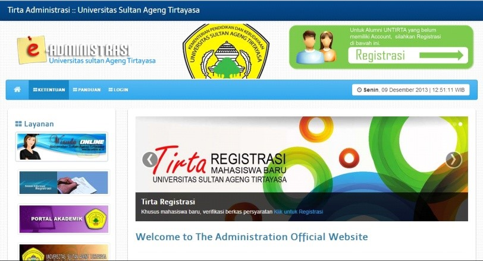
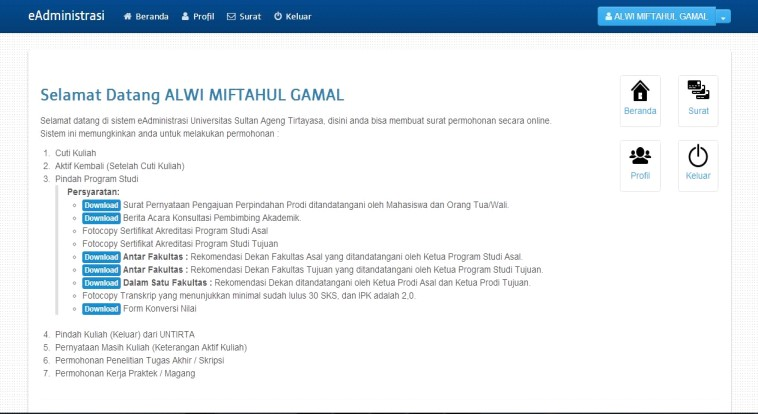
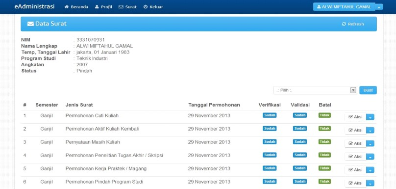
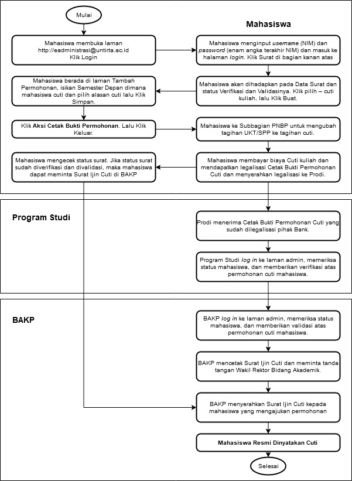

# PENGAJUAN IJIN CUTI KULIAH

Ketentuan pengajuan permohonan ijin cuti kuliah sebagai penjelasan dari
Pedoman Akademik. Setiap Mahasiswa Untirta yang tidak berencana untuk
mengambil kuliah pada semester yang berikutnya wajib mengetahui
ketentuan dan melakukan prosedur cuti kuliah. Prosedur ini diambil untuk
menghindarkan mahasiswa dari sanksi akademik **dicutikan**. Pada
prosesnya prosedur ini melibatkan 6 (enam) entitas:

1.  Mahasiswa
2.  Bank
3.  Jurusan/Program Studi/Fakultas/Pascasarjana
4.  Subbagian Registrasi dan Statistik, BAKP -- Wakil Rektor Bidang
    Akademik
5.  Subbagian PNBP, BUKK
6.  Pusat Data dan Informasi (PUSDAINFO).

## Ketentuan Pengajuan Cuti Kuliah

1.  Selama ijin cuti kuliah dibebaskan dari pembayaran SPP/UKT, tetapi
    diwajibkan membayar uang registrasi biaya cuti kuliah yang
    besarannya ditetapkan oleh Keputusan Rektor, pembayaran sesuai
    dengan bank yang ditunjuk.
2.  Masa ijin cuti kuliah diperhitungkan dalam batas waktu maksimal
    penyelesian studi.
3.  Hak Cuti kuliah maksimal 2 (dua) semester, baik secara
    berturut-turut maupun secara terpisah.
4.  Pengajuan ijin cuti kuliah diperkenankan apabila minimal telah
    menyelesaikan studi 2 (dua) semester dan maksimal semester 12 (dua
    belas).
5.  Alasan cuti kuliah yang rasional (*reasonable*)
6.  Pengajuan ijin cuti kuliah setelah kegiatan perkuliahan dimulai
    tidak akan dilayani dan tidak akan diproses.
7.  Permohonan Ijin cuti kuliah diproses oleh
    Jurusan/Prodi/Fakultas/Pascasarjana untuk diverifikasi dan
    diproses juga oleh Subbagian Registrasi dan Statistik Biro Akademik,
    Kemahasiswaan, dan Perencanaan (BAKP) untuk divalidasi dan dicetak
    serta ditandatangani oleh Wakil Rektor Bidang Akademik.
8.  Setelah batas waktu ijin Cuti Kuliah berakhir mahasiswa harus segera
    mengajukan permohonan aktif kuliah kembali diproses oleh Prodi untuk
    diverifikasi dan diproses juga oleh Subbagian Registrasi dan
    Statistik Biro Akademik, Kemahasiswaan, dan Perencanaan (BAKP) untuk
    divalidasi dan dicetak serta ditandatangani oleh Wakil Rektor Bidang
    Akademik.

## Waktu Registrasi (3)

Mahasiswa yang melakukan permohonan cuti kuliah mengacu pada ketentuan
yang telah dituangkan dalam kalender akademik baik pada semester gasal
diajukan sebelum kegiatan perkuliahan semester gasal maupun pada
semester genap sebelum kegiatan perkuliahan semester genap, sehingga
mahasiswa sudah mempunyai dasar dan gambaran yang pasti akan waktu
pelaksanaan kegiatan cuti dan waktu pelaksanaan kegiatan aktif kuliah
kembali.

## Prosedur Pengajuan Cuti Kuliah

1.  **Mahasiswa**

    Prosedur lengkap pengambilan cuti kuliah oleh mahasiswa adalah
    sebagai berikut:

    1.  Mahasiswa membuka laman
        [**http://eadministrasi.untirta.ac.id**](http://eadministrasi.untirta.ac.id){target="_blank"}Klik
        Login.

        {width="600"}

    2.  Mahasiswa menginput *username* (NIM) dan *password* (enam angka
        terakhir NIM) dan masuk ke halaman *login*.

        

        Klik Surat di laman bagian kanan atas.

        {width="600"}

    3.  Mahasiswa akan dihadapkan pada Data Surat dan status Verifikasi
        dan Validasinya. Klik pilih -- cuti kuliah, lalu Klik Buat.

        {width="600"}

    4.  Mahasiswa berada di laman Tambah Permohonan, isikan Semester
        Depan dimana mahasiswa cuti dan pilih alasan cuti lalu Klik
        Simpan. Klik **Aksi Cetak Bukti Permohonan**. Lalu Klik Keluar.

    5.  Mahasiswa ke Subbagian PNBP untuk mengubah tagihan UKT/SPP ke
        tagihan cuti.

    6.  Mahasiswa membayar biaya Cuti kuliah yang ditetapkan dalam
        Keputusan Rektor ke Bank yang telah ditunjuk dan mendapatkan
        **legalisasi Cetak Bukti Permohonan Cuti** dan menyerahkan
        legalisasi ke Prodi/Fakultas.

    7.  Mahasiswa mengecek status surat dengan cara *log in* kembali.
        Jika status surat sudah diverifikasi dan divalidasi, maka
        mahasiswa dapat meminta Surat Ijin Cuti di BAKP.

2.  **Jurusan/Program Studi/Fakultas/Pascasarjana**

    1.  Jurusan/Program Studi/Fakultas/Pascasarjana menerima Cetak Bukti
        Permohonan Cuti yang sudah dilegalisasi pihak Bank.
    2.  Jurusan/Program Studi/Fakultas/Pascasarjana *log in* ke laman
        admin, memeriksa status mahasiswa, dan memberikan verifikasi
        atas permohonan cuti mahasiswa.

3.  **Biro Akademik, Kemahasiswaan, dan Perencanaan (BAKP)**

    Biro Akademik, Kemahasiswaan dan Perencanaan (BAKP) melalui
    Subbagian Registrasi dan Statistik memproses Pengajuan Ijin Cuti
    Kuliah yang telah memenuhi persyaratan.

    1.  Log in ke laman admin, memeriksa status mahasiswa, dan
        memberikan validasi atas permohonan cuti mahasiswa.
    2.  Mencetak Surat Ijin Cuti dan meminta tanda tangan Wakil Rektor
        Bidang Akademik.
    3.  Menyerahkan Surat Ijin Cuti kepada mahasiswa yang mengajukan
        permohonan. Tembusan diberikan ke PNBP, Pusdainfo, dan
        Prodi/Fakultas/Pascasarjana.
    4.  Mendokumentasikan/mengarsipkan Surat Ijin Cuti.

4.  **Mahasiswa**

    Mahasiswa mengambil Surat Cuti yang telah ditandatangani Wakil
    Rektor Bidang Akademik di Subbagian Registrasi dan Statistik.

5.  **Pusdainfo (Pusat Data dan Informasi)**

    Pusat Data dan Informasi (Pusdainfo) mengubah status data mahasiswa
    dari mahasiswa aktif kuliah menjadi mahasiswa cuti kuliah di
    semester yang bersangkutan.

## Petugas Registrasi (3)

Petugas Registrasi yang terkait dalam pelaksanaan tersebut melibatkan:

1.  Biro Akademik, Kemahasiswaan, dan Perencanaan (BAKP)

    Biro Akademik, Kemahasiswaan dan Perencanaan (BAKP) Universitas
    Sultan Ageng Tirtayasa melalui Subbagian Registrasi dan Statistik
    melaksanakan tugasnya melayani mahasiswa melakukan permononan cuti
    kuliah, mendokumentasikan laporan, dan melakukan koordinasi dengan
    Subbagian Penerimaan Negara Bukan Pajak (PNBP), Pusat Data dan
    Informasi (PUSDAINFO), Jurusan/Prodi/Fakultas dan Subbagian Akademik
    Pascasarjana.

2.  Biro Umum, Keuangan dan Kepegawaian (BUKK).

    Biro Umum, Keuangan, dan Kepegawaian (BUKK) Universitas Sultan Ageng
    Tirtayasa melaksanakan tugasnya sebagai biro yang menangani bidang
    keuangan melalui Subbagian Penerimaan Negara Bukan Pajak (PNBP) yang
    ditugaskan melayani mahasiswa yang melakukan permohonan cuti kuliah:
    Memberikan verifikasi/surat pengantar pembayaran cuti kuliah kepada
    mahasiswa yang melakukan permohonan cuti kuliah dan persyaratan
    akademik sudah dilengkapi, mendokumentasikan laporan, melakukan
    koordinasi dengan Subbagian Registrasi dan Statistik (BAKP), Pusat
    Data dan Informasi (PUSDAINFO), Subbagian Akademik Pascasarjana,
    Jurusan/Prodi/Fakultas dan petugas bank yang ditunjuk Bank BNI.

3.  Bank (Bank yang ditunjuk adalah Bank Negara Indonesia/BNI)

    Melaksanakan tugasnya sebagai Bank yang ditunjuk oleh Universitas
    Sultan Ageng Tirtayasa sebagai Bank yang menerima pembayaran
    mahasiswa yang melakukan cuti kuliah, melaksanakan koordinasi dengan
    Subbagian Penerimaan Negara Bukan Pajak (PNBP), Subbagian Registrasi
    dan Statistik (BAKP), Pusat Data dan Informasi (PUSDAINFO), dan
    Subbagian Akademik Pascasarjana.

4.  Pusat Data dan Informasi (PUSDAINFO)

    Pusat Data dan Informasi (PUSDAINFO**)** menerima data mahasiswa
    yang telah mengajukan permohonan cuti kuliah, mengubah status
    mahasiswa menjadi cuti kuliah, mendokumentasikan laporan,
    melaksanakan koordinasi dengan Subbagian Penerimaan Negara Bukan
    Pajak (PNBP), Subbagian Registrasi dan Statistik,
    Jurusan/Prodi/Fakultas, Subbagian Akademik Pascasarjana, dan petugas
    bank yang ditunjuk yaitu Bank BNI.

5.  Program Studi/Fakultas/Pascasarjana

    Program Studi/Fakultas/Pascasarjana menerima data yang telah
    divalidasi dan dicetak surat cuti kuliah serta sudah ditandatangani
    oleh Wakil Rektor Bidang Akademik / sudah disetujui,
    mendokumentasikan laporan, melaksanakan koordinasi dengan Subbagian
    Penerimaan Negara Bukan Pajak (PNBP), Subbagian Registrasi dan
    Statistik, dan Pusat Data dan Informasi (PUSDAINFO).

*Flowchart* Permohonan Ijin Cuti Kuliah

