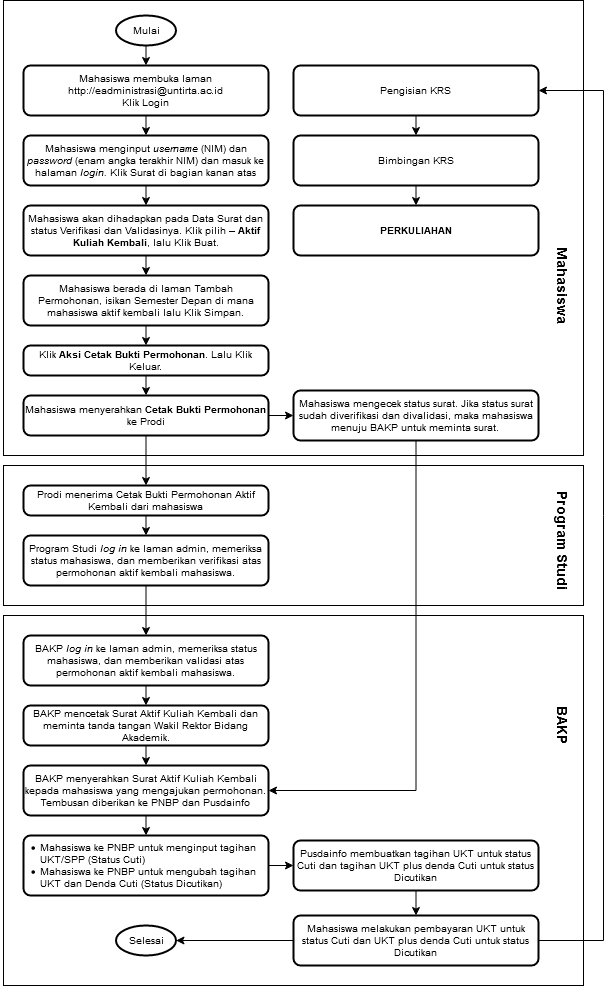

# PENGAJUAN AKTIF KULIAH KEMBALI

Ketentuan dan prosedur pengajuan permohonan Aktif Kuliah Kembali wajib dilaksanakan oleh mahasiswa yang status semester sebelumnya adalah cuti dan di cutikan sebelum melakukan registrasi pembayaran SPP/UKT. Pada prosesnya prosedur ini melibatkan 6 (enam) entitas :

1.  Mahasiswa
2.  Bank
3.  Program Studi/Fakultas/Pascasarjana
4.  Subbagian Registrasi dan Statistik, BAKP -- Wakil Rektor Bidang Akademik
5.  Subbagian PNBP/BUKK
6.  Pusat Data dan Informasi (PUDAINFO).

## Ketentuan Pengajuan Aktif Kuliah Kembali

1.  Apa bila surat ijin Aktif Kuliah Kembali telah disetujui Wakil Rektor Bidang Akademik (kondisi cuti / status cuti), maka mahasiswa yang bersangkutan membayar registrasi dan uang kuliah/SPP/UKT sesuai ketentuan pada semester dan tahun akademik yang akan diambil. Prosedur heregistrasi sama seperti mahasiswa aktif. Jika kondisi dari dicutikan/tidak mengusulkan cuti maka dicutikan oleh sistem. 

2.  Sebagaimana yang telah diatur pada prosedur permohonan cuti, bahwa prosedur ini wajib diambil bagi seluruh mahasiswa Untirta yang sebelumnya berstatus cuti atau dicutikan. Prosedur ini wajib ditempuh karena ada 2 (dua) hal, yaitu:

    a.  Mahasiswa tidak akan bisa membayar SPP/UKT pada semester yang akan datang, tanpa melaksanakan prosedur ini.

    b.  Mahasiswa tidak akan bisa *login* ke portal SIAKAD online jika prosedur ini tidak ditempuh.

## Waktu Registrasi (4)

PengajuanAktif Kuliah dilakukan sebelum perkuliahan dimulai mengikuti jadwal pada Kalender
Akademik yang berlaku. Untuk semester gasal diajukan sebelum kegiatan perkuliahan semester gasal di mulai, untuk semester genap diajukan sebelum kegiatan perkuliahan semester genap dimulai, sehingga mahasiswa sudah mempunyai dasar dan gambaran yang pasti akan waktu pelaksanaan kegiatan registrasi aktif kuliah kembali tersebut dan proses perkuliahan dapat berjalan dengan baik.

## Prosedur Pengajuan Aktif Kuliah Kembali

A.  **Mahasiswa**

    Mahasiswa yang sebelumnya MELAKUKAN PROSEDUR CUTI (status cuti)

    1.  Mahasiswa membuka laman [**http://eAdministrasi.untirta.ac.id**](http://eAdministrasi.untirta.ac.id){target="_blank"}Klik **Login**

    2.  Mahasiswa meng-*input username* (NIM) dan *password* (dari email) dan masuk ke halaman *login*. Klik Surat di laman bagian kanan atas.

    3.  Mahasiswa akan dihadapkan pada Data Surat dan status Verifikasi dan Validasi. Klik pilih -- Aktif Kuliah Kembali, lalu Klik Buat.

    4.  Mahasiswa berada di laman Tambah Permohonan, isikan Semester Depan di mana mahasiswa aktif kembali lalu Klik Simpan.

    5.  Klik **Aksi Cetak Bukti Permohonan**. Lalu Klik Keluar

    6.  Mahasiswa menyerahkan **Cetak Bukti Permohonan** ke Program Studi untuk diverifikasi

    7.  Sampai dengan surat jadi Mahasiswa dapat mengecek status surat, jika status surat sudah diverifikasi dan divalidasi, maka mahasiswa dapat mengambil surat di BAKP.

    8.  Mahasiswa ke PNBP untuk meng-*input* tagihan UKT/SPP.

    9.  Mahasiswa membayar UKT/SPP di bank.

    Mahasiswa yang sebelumnya **tidak** MELAKUKAN PROSEDUR CUTI (status dicutikan)

    1.  Mahasiswa membuka laman [**http://eAdministrasi.untirta.ac.id**](http://eAdministrasi.untirta.ac.id){target="_blank"}Klik **Login**
    2.  Mahasiswa meng-*input username* (NIM) dan *password* (dari email) dan masuk ke halaman *login*. Klik Surat di laman bagian kanan atas.
    3.  Mahasiswa akan dihadapkan pada Data Surat dan status Verifikasi dan Validasinya. Klik pilih -- Aktif Kuliah Kembali, lalu Klik Buat.
    4.  Mahasiswa berada di laman Tambah Permohonan, isikan Semester Depan dimana mahasiswa aktif kembali lalu Klik Simpan.
    5.  Klik **Aksi Cetak Bukti Permohonan**. Lalu Klik Keluar
    6.  Mahasiswa menyerahkan **Cetak Bukti Permohonan** ke Prodi untuk diverifikasi
    7.  Sampai dengan surat jadi Mahasiswa dapat mengecek status surat, jika status surat sudah verifikasi dan validasi, maka mahasiswa dapat mengambil surat di bagian Registrasi dan Statistik BAKP.
    8.  Mahasiswa ke PNBP untuk meng-*input* tagihan UKT/SPP dan denda cuti..
    9.  Mahasiswa membayar UKT/SPP dan denda cuti di bank.

B.  **Jurusan/Program Studi/Fakultas/Pascasarjana**

    1.  Jurusan/Program Studi/Fakultas/Pascasarjana meneliti dan memeriksa berkas persyaratan permohonan Aktif Kuliah Kembali.
    2.  Jurusan/Program Studi/Fakultas/Pascasarjana menerima Cetak Bukti Permohonan Aktif Kembali dari mahasiswa.
    3.  Jurusan/Program Studi/Fakultas/Pascasarjana *login* ke laman admin, memeriksa status mahasiswa (sebelumnya cuti/dicutikan), dan melakukan **verifikasi** atas permohonan aktif kembali mahasiswa.

C.  **Biro Akademik, Kemahasiswaan dan Perencanaan (BAKP)**

    Biro Akademik, Kemahasiswaan, dan Perencanaan (BAKP) melalui Subbagian Registrasi dan Statistik memproses Pengajuan Ijin Cuti Kuliah yang telah memenuhi persyaratan.

    1.  Log in ke laman admin, memeriksa status mahasiswa, dan memberikan **validasi** atas permohonan aktif kembali mahasiswa.
    2.  Mencetak Surat Aktif Kembali dan meminta tanda tangan Wakil Rektor Bidang Akademik.
    3.  Menyerahkan Surat Aktif Kembali kepada mahasiswa yang mengajukan permohonan. Tembusan diberikan ke PNBP, Pusdainfo, Proram Studi/Fakultas/Pascasarjana.
    4.  Mendokumentasikan/mengarsipkan surat Ijin Aktif Kuliah Kembali.

D.  **PUSDAINFO (Pusat Data dan Informasi)**

    Pusdainfo membuatkan tagihan SPP/UKT untuk mahasiswa dinyatakan Aktif Kembali.

## Prosedur Kontrak Mata Kuliah (4)

ProgramSarjana dan Diploma **(**S1 dan D3) dapat melakukan registrasi *online*, dengan melakukan prosedur sebagai berikut :

## Petugas Registrasi (4)

Petugas Registrasi yang terkait dalam pelaksanaan tersebut melibatkan:

1.  Biro Akademik, Kemahasiswaan, dan Perencanaan (BAKP)
    Biro Akademik, Kemahasiswaan, dan Perencanaan (BAKP) Universitas Sultan Ageng Tirtayasa melalui Subbagian Registrasi dan Statistik melaksanakan tugasnya melayani kegiatan registrasi Akademik permohonan mahasiswa aktif kuliah kembali, mendokumentasikan laporan, melakukan koordinasi dengan Subbagian Penerimaan Negara BukanPajak (PNBP), Pusat Data dan Informasi (PUSDAINFO), Jurusan/Prodi/Fakultas, Subbagian Akademik Pascasarjana, dan petugas bank yang ditunjuk Bank BNI.

2.  Biro Umum, Keuangan, dan Kepegawaian (BUKK).

    Biro Umum, Keuangan, dan Kepegawaian (BUKK) Universitas Sultan Ageng Tirtayasa melaksanakan tugasnya sebagai biro yang menangani bidang keuangan melalui Subbagian Penerimaan Negara Bukan Pajak (PNBP) yang ditugaskan melayani mahasiswa yang melakukan registrasi aktif kuliah kembali, mendokumentasikan laporan dan melakukan koordinasi dengan Subbagian Registrasi dan Statistik, Pusat Data dan Informasi (PUSDAINFO), Jurusan/Prodi/Fakultas, Subbagian Akademik Pascasarjana, dan petugas bank yang ditunjuk yaitu Bank BNI.

3.  Bank (Bank yang ditunjuk adalah Bank Negara Indonesia/BNI)

    Melaksanakan tugasnya sebagai Bank yang ditunjuk oleh Universitas Sultan Ageng Tirtayasa
    sebagai Bank yang menerima pembayaran dari mahasiswa yang melakukan registrasi aktif kuliah kembali yaitu : Uang Kuliah Tunggal (UKT) program Sarjana (S1) dan Diploma (D3) dan Sumbangan Pengembangan Pendidikan (SPP) Program Magister (S2), melaksanakan koordinasi dengan Subbagian Penerimaan Negara Bukan Pajak (PNBP), Pusat Data dan Informasi (PUSDAINFO), dan Subbagian Registrasi dan Statistik.

4.  Pusat Data dan Informasi (PUSDAINFO)

    a.  Pusat Data dan Informasi (**PUSDAINFO)** menerima data mahasiswa yang melakukan aktif kuliah kembali dan telah mengisi Kartu Rencana Studi (KRS) dan telah melakukan bimbingan akademiknya, mahasiswa segera menyerahkan Kartu Rencana Studi (KRS) nya ke Pusat Data dan Informasi (PUSDAINFO) baik cetak maupun elektronik.
    b.  Mengolah data dan menerbitkan Kartu Rencana Studi (KRS) dan Daftar Hadir Mahasiswa dan Dosen (DHMD).
    c.  Mendokumentasikan laporan.
    d.  Melaksanakan koordinasi dengan Subbagian Penerimaan Negara Bukan Pajak (PNBP), Subbagian Registrasi dan Statistik, Subbagian Akademik Pascasarjana, Jurusan/Program Studi, Fakultas, dan petugas bank yang ditunjuk yaitu Bank BNI.

5.  Jurusan/Program Studi/Fakultas/Pascasarjana

    a.  Jurusan/Program Studi/Fakultas/Pascasarjana menerima data dari mahasiswa yang melakukan permohonan aktif kuliah kembali sesuai dengan persyaratan yang telah dilengkapi dan menerima data yang telah membayar di verifikasi serta menerima data setelah di validasi dan disetujui serta sudah membayar registrasi.
    b.  Membuat jadwal perkuliahan dan Daftar Hadir Mahasiswa dan Dosen (DHMD).
    c.  Mendokumentasikan laporan.

6.  Pascasarjana

    a.  Subbagian Akademik Pascasarjana menerima data mahasiswa yang telah mengisi pada Kartu Rencana Studi (KRS) dan mendapat bimbingan akademiknya, mahasiswa segera menyerahkan Kartu Rencana Studi (KRS) nya ke Subbagian Akademik Pascasarjana.
    b.  Mengolah data dan menerbitkan Kartu Rencana Studi (KRS) dan Daftar Hadir Mahasiswa dan Dosen (DHMD).
    c.  Mendokumentasikan laporan.

7.  Pascasarjana/Fakultas

    Mengendalikan operasional jalannya kegiatan perkuliahan sesuai dengan jadwal perkuliahan yang telah ditentukan.

