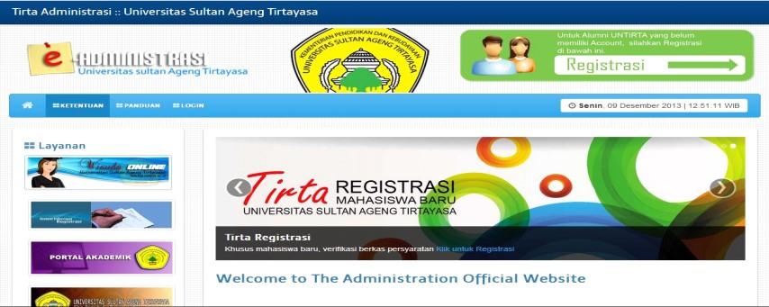
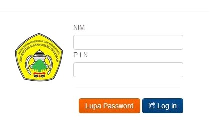
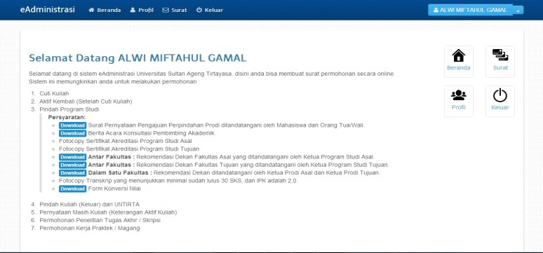
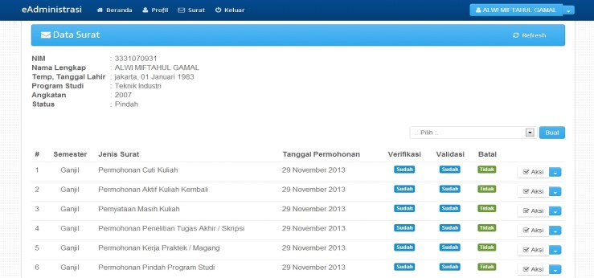
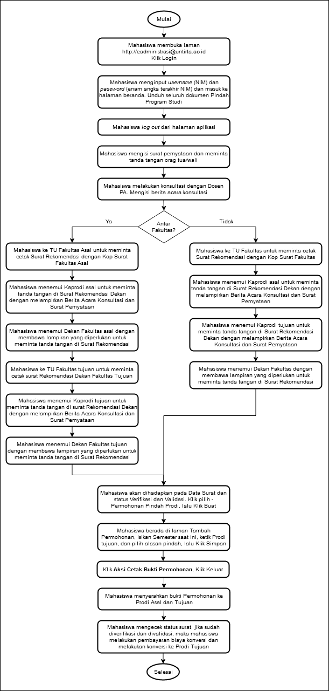

# PENGAJUAN PINDAH PROGRAM STUDI

Prosedur ini ditujukan untuk mengatur proses pembuatan Surat Pindah Program Studi bagi mahasiswa yang akan pindah ke Program Studi lainnya di dalam Untirta. Fakultas dalam hal ini hanya bertindak sebagai monitoring dan mengetahui (sebagai laporan) bahwa ada mahasiswanya yang pindah program studi di internal Untirta, Prosedur Surat Pindah Program Studi ini pada prosesnya melibatkan 7 (tujuh) entitas yaitu:

1.  Mahasiswa
2.  Bank
3.  Program Studi/Fakultas Asal
4.  Program Studi/Fakultas Tujuan
5.  Subbagian Regsitrasi dan Statistik, BAKP -- Wakil Rektor Bidang Akademik
6.  Subbagian PNBP/BUKK
7.  Pusat Data dan Informasi (Pusdainfo)

## Ketentuan Umum Pengajuan Pindah Program Studi

1.  Mahasiswa aktif yang tidak pernah mengajukan cuti kuliah atau dicutikan, dibuktikan dengan KHS lengkap setiap semester.
2.  Diperkenankan pindah Program Studi apabila mahasiswa telah menempuh studi minimal 2 (dua) semester dan maksimal aktif di semester 5 (lima).
3.  Alasan mahasiswa yang mengajukan Pindah Program Studi IPK minimal kurang dari 2.75
4.  Mengajukan pindah Program Studi sesuai dengan jadwal kalender akademik/maksimal 1 (satu) minggu sebelum perkuliahan dimulai.
5.  Mahasiswa berasal dari Program Studi dengan Nilai Akreditasi minimal sama dengan Program Studi yang dituju.
6.  Bagi mahasiswa yang mengajukan pindah Program Studi harus melakukan permohonan pindah Program Studi dan mendapat persetujuan dari Jurusan/Program Studi, Fakultas asal serta dapat menerima Jurusan/Program Studi, Fakultas yang dituju.
7.  Bagi mahasiswa yang mengajukan pindah Program Studi dikenakan biaya konversi yang telah ditetapkan dalam Keputusan Rektor.
8.  Perpindahan Program Studi hanya di mungkinkan dilakukan 1 (satu) kali selama menjadi mahasiswa Untirta.

**Persyaratan :**

1.  Surat Pernyataan Pengajuan Perpindahan Prodi ditandatangani oleh Mahasiswa dan Orang Tua/Wali. (wajib diunduh di menu *download* pada laman [http://eadministrasi.untirta.ac.id/download](http://eadministrasi.untirta.ac.id/download).)).

2.  Berita Acara Konsultasi Dosen Pembimbing Akademik(PA) (wajib didownload di menu *download* pada laman [http://eadministrasi.untirta.ac.id/download)](http://eadministrasi.untirta.ac.id/download).).

3.  Fotocopy Sertifikat Akreditasi Program Studi Asal.

4.  Fotocopy Sertifikat Akreditasi Program Studi Tujuan.

5.  **Antar Fakultas**

    a.  Rekomendasi Dekan Fakultas Asal yang ditandatangani oleh Ketua Program Studi Asal. (wajib
        diunduh di menu *download* pada laman [http://eadministrasi.untirta.ac.id/download](http://eadministrasi.untirta.ac.id/download).)).
    b.  Rekomendasi Dekan Fakultas Tujuan yang ditandatangani oleh Ketua Program Studi Tujuan. (wajib diunduh di menu *download* pada laman [http://eadministrasi.untirta.ac.id/download](http://eadministrasi.untirta.ac.id/download).)).

6.  **Dalam Satu Fakultas** : Rekomendasi Dekan ditandatangani oleh Ketua Prodi Asal dan Ketua Prodi Tujuan (wajib diunduh di menu *download* pada laman [http://eadministrasi.untirta.ac.id/download).](http://eadministrasi.untirta.ac.id/download).)

7.  Fotocopy Transkrip yang menunjukkan minimal sudah lulus 30 SKS, dan IPK adalah 2,0.

8.  Form Konversi yang ditandatangani oleh Ketua Program Studi Tujuan dan distempel Fakultas Tujuan.

9.  Tidak memiliki tunggakan SPP/UKT.

## Waktu Registrasi (5)

PengajuanPermohonan Pindah Program Studi dilakukan sebelum perkuliahan dimulai mengikuti jadwal
pada Kalender Akademik yang berlaku. (Untuk semester gasal diajukan sebelum kegiatan perkuliahan semester gasal dimulai, untuk semester genap diajukan sebelum kegiatan perkuliahan semester genap dimulai, sehingga mahasiswa sudah mempunyai dasar dan gambaran yang pasti akan waktu pelaksanaan kegiatan tersebut, dan proses perkuliahan dapat berjalan dengan baik.

## Prosedur Pengajuan Pindah Program Studi

A.  **Mahasiswa**

    1.  Mahasiswa membuka laman [**http://eadministrasi.untirta.ac.id**](http://eadministrasi.untirta.ac.id){target="_blank"}Klik **Login**.

        {width="800"}

    2.  Mahasiswa meng-*input username* (NIM) dan *password* (dari email) dan masuk ke halaman *login* (menu awal / beranda)

        

    3.  Mahasiswa mendownload Surat Pernyataan, Berita Acara Bimbingan Konsultasi Dosen (PA), dan untuk pindah Prodi Antar Fakultas download Surat Rekomendasi Dekan Fakultas Asal &Surat Rekomendasi Dekan Fakultas Tujuan, serta untuk pindah Prodi dalam satu Fakultas download Surat Rekomendasi Dekan Fakultas.

    4.  Mahasiswa *logout* dari aplikasi, dan mengisi serta mempersiapkan seluruh persyaratan.

    5.  Mahasiswa *login* kembali dengan meng-*input* *username* (NIM) dan *password* (dari email) dan masuk ke halaman *login*. Klik Surat di laman bagian kanan atas.

        

    6.  Mahasiswa akan dihadapkan pada Data Surat dan status Verifikasi dan Validasinya. Klik pilih -- Permohonan Pindah Program Studi, lalu Klik Buat.

        

    7.  Mahasiswa berada di laman Tambah Permohonan, isikan Semester Pindah, Program Studi Tujuan dan alasan pindah, lalu Klik Simpan.

    8.  Klik **Aksi Cetak Bukti Permohonan**. Lalu Klik Keluar.

    9.  Mahasiswa menyerahkan **Cetak Bukti Permohonan** dan mengurus seluruh persyaratan dan rekomendasi Pindah Prodi ke Prodi Asal, dan Prodi Tujuan. Masing -- masing fotocopian 1 berkas.

    10. Mahasiswa ke Sub.Bagian Registrasi/BAKP untuk memeriksa kelengkapan Pindah Prodi. BAKP menginformasikan ke Pusdainfo dan PNBP/BUKK dengan membuatkan surat keterangan.

    11. Mahasiswa ke Pusdainfo untuk update data di sireg dengan prodi baru.

    12. Mahasiswa ke PNBP/BUKK untuk mengupdate tagihan , PNBP membuat tagihan dengan NIM lama sebagai no.peserta dan prodi adalah prodi tujuan.

    13. Mahasiswa membayar dibank dengan menyebut NIM lama (sebagai no peserta) dengan prodi tujuan.

    14. Mahasiswa ke Sub.Bagian Registrasi/BAKP untuk meminta NIM baru, Sub.Bagian Registrasi/BAKP meng-create NIM baru dengan memanggil no peserta (menggunakan NIM lama), mahasiswa mendapatkan NIM dan Password baru.

    15. Mahasiswa menyerahkan dokumen konversi ke Pusadainfo.

    16. Mahasiswa login dan mengecek daftar mata kuliah ditranskrip mahasiswa (seharusnya sudah ada nama mata kuliah yang masuk dalam dokumen konversi).

    17. Mahasiswa melakukan Kartu Rencana Studi sesuai dengan jadwal.

B.  **Program Studi Asal**

    1.  Program Studi Asal menerima Cetak Bukti Permohonan Pindah Program dan  persyaratan 1-6 (fotocopy) dari mahasiswa. 
    2.  Program Studi Asal laman admin, memeriksa status mahasiswa, dan memberikan **verifikasi** permohonan Surat Pindah Program Studi atau **menolaknya.**

C.  **Program Studi Tujuan**

    1.  Program StudiTujuan menerima Cetak Bukti Permohonan Pindah Program Studi  dan persyaratan 1-6 (foto copy) dari mahasiswa.
    2.  Program Studi Tujuanlog in ke laman admin, memeriksa persyaratan 1-6 (foto copy) dari mahasiswa / status mahasiswa, dan memberikan **verifikasi** permohonan Surat Pindah Prodi atau **menolaknya**.

D.  **Biro Akademik, Kemahasiswaan, dan Perencanaan (BAKP)**

    Biro Akademik, Kemahasiswaan dan Perencanaan (BAKP) melalui Sub.Bagian Registrasi dan Statistik memproses pengajuan Pindah Program Studi yang telah memenuhi persyaratan :

    1.  Log in memeriksa status mahasiswa termasuk status pembayaran, lalu memberikan **validasi**
        atas permohonan Surat Pindah Program Studi, Namun tidak dapat melakukan validasi selama Program Studi belum memberikan verifikasi.
    2.  Menerima Bukti Permohonan yang telah divalidasi pihak Bank dan persyaratan 1 --7 (Asli) dari mahasiswa.
    3.  Setelah Validasi BAKP mencetak Surat Pindah Program Studi dan meminta tanda tangan Wakil Rektor I Bidang Akademik.
    4.  Memeriksa Bukti Permohonan yang telah divalidasi pihak Bank dan persyaratan 1 --7 (Dokumen Asli). Jika sudah lengkap, BAKP meminta Pusdainfo membuat NIM baru atas nama Mahasiswa pemohon dan menginputkan nilai hasil konversi.
    5.  Menerima NIM baru mahasiswa beserta *password* untuk SIAKAD Online dari UPT. Pusdainfo.
    6.  Menginput NIM baru Mahasiswa pada aplikasi eadministrasi dan mencetak Surat Pindah Program Studi.
    7.  Menyerahkan Surat Pindah Program Studi ke Mahasiswa.
    8.  Membuat tembusan ke PNBP dan Pusdainfo terkait pindahnya mahasiswa tersebut.

## Prosedur Kontrak Mata Kuliah (5)

## Petugas Registrasi (5)

Petugas Registrasi yang terkait dalam pelaksanaan tersebut melibatkan:

1.  **Biro Akademik, Kemahasiswaan, dan Perencanaan (BAKP).**

    Biro Akademik, Kemahasiswaan dan Perencanaan (BAKP) Universitas Sultan Ageng Tirtayasa melalui Sub Bagian Registrasi dan Statistik melaksanakan tugasnya melayani mahasiswa yang melakukan Permohonan Pindah Program Studi registrasi berdasarkan akademik, Mendokumentasikan laporan dan Melakukan  koordinasi Sub Bagian Penerimaan Negara Bukan Pajak (PNBP), Pusat  Data dan Informasi (PUSDAINFO),  Jurusan/Prodi/Fakultas, Sub Bagian Akademik Pascasarjana dan petugas bank yang ditunjuk Bank BNI.

2.  **Biro Umum, Keuangan dan Kepegawaian (BUKK).**

    Biro Umum, Keuangan, dan Kepegawaian (BUKK) Universitas Sultan Ageng Tirtayasa melaksanakan tugasnya sebagai biro yang menangani bidang keuangan melalui sub bagian Penerimaan Negara Bukan Pajak (PNBP) yang ditugaskan melayani mahasiswa yang melakukan Permohonan Pindah Program Studi registrasi keuangan pembayaran SPP/UKT dan Biaya konversi, Mendokumentasikan laporan dan Melakukan Koordinasi pada Sub Bagian Registrasi dan Statistik, Pusat Data dan
    Informasi (PUSDAINFO), Jurusan/Prodi/Fakultas, Sub Bagian Akademik Pascasarjana
    dan petugas bank yang ditunjuk yaitu Bank BNI.

3.  **Bank (Bank yang ditunjuk adalah Bank Negara Indonesia/BNI).**

    Melaksanakantugasnya sebagai Bank yang ditunjuk oleh Universitas Sultan Ageng Tirtayasa sebagai Bank yang menerima pembayaran mahasiswa   yang melakukan Pindah Program Studi dan melakukan registrasi pembayaran SPP/UKT dan pembayaran konversi, melaksanakan koordinasi Sub
    Bagian Penerimaan Negara Bukan Pajak (PNBP), Pusat  Data dan Informasi (PUSDAINFO), dan Subbagian Registrasi dan Statistik.

4.  **Pusat Data dan Informasi (PUSDAINFO).**

    a.  Pusat Data dan Informasi (**PUSDAINFO)** menerima data mahasiswa yang melakukan Pindah Program Studi yaitu merubah status Program Studinya dan telah mengisi Kartu Rencana Studi (KRS) serta telah melakukan  bimbingan akademiknya, mahasiswa segera menyerahkan Kartu Rencana Studi (KRS) nya ke Pusat Data dan Informasi (PUSDAINFO) baik cetak maupun elektronik.
    b.  Mengolah data dan menerbitkan Kartu Rencana Studi (KRS) dan Daftar Hadir Mahasiswa dan Dosen (DHMD).
    c.  Mendokumentasikan laporan.
    d.  Melaksanakan koordinasi dengan Subbagian Penerimaan Negara Bukan Pajak (PNBP), Subbagian Registrasi dan Statistik, Subbagian Akademik Pascasarjana, Jurusan/Program Studi, Fakultas, dan petugas bank yang ditunjuk yaitu Bank BNI.

5.  **Jurusan/Program Studi/Fakultas/Pascasarjana.**

    a.  **Program Studi/Fakutas**

        1.  Jurusan/Program Studi/Fakultas/Pascasarjana menerima data dari mahasiswa yang melakukan Permohonan Pindah Program Studi sesuai dengan persyaratan yang telah dilengkapi dan menerima data perubahan status program studinya.
        2.  Membuat jadwal perkuliahan dan Daftar Hadir Mahasiswa dan Dosen (DHMD).
        3.  Mendokumentasikan laporan.
        4.  Mengendalikan operasional jalannya kegiatan perkuliahan sesuai dengan jadwal perkuliahan yang telah ditentukan.

    b.  **Pascasarjana**

        1.  Subbagian Akademik Pascasarjana menerima data mahasiswa yang telah berubah status program studinya mengisi Kartu Rencana Studi (KRS) dan mendapat bimbingan akademiknya, mahasiswa segera menyerahkan Kartu Rencana Studi (KRS) nya ke Subbagian Akademik Pascasarjana.
        2.  Mengolah data dan menerbitkan Kartu Rencana Studi (KRS) dan Daftar Hadir Mahasiswa dan Dosen (DHMD).
        3.  Mendokumentasikan laporan.
        4.  Mengendalikan operasional jalannya kegiatanperkuliahan

